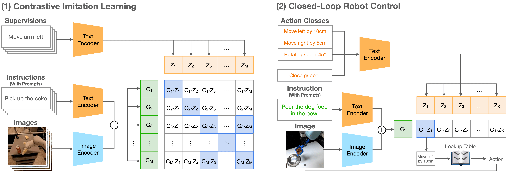

# CLIP-RT

[[Project Page]](https://clip-rt.github.io) [[Paper]](https://arxiv.org/abs/2411.00508) [[Citations]](#citing)

CLIP-RT (CLIP-based Robotics Transformer) is a vision-language-action (VLA) model for generalist manipulation policies. We seamlessly extend OpenAI's [CLIP](https://arxiv.org/abs/2103.00020) to robot learning. It learns to predict the robotic action specified in natural language, given an image and natural language instruction. We found CLIP-RT effectively learns end-to-end robotic policies for novel robotic manipulation tasks.


## Approach

   


## Usage

CLIP-RT is based on an open source implementation of CLIP, OpenCLIP. You can easily use CLIP models with different configurations through a plug-and-play approach. In our project, we used pytorch v2.3.1 and open_clip_torch v2.26.1. For more details, please consult [OpenCLIP's directory](https://github.com/mlfoundations/open_clip).

```
python3 -m venv clip-rt
source clip-rt/bin/activate
pip install -U pip
pip install open_clip_torch
```


```python
import json
import torch
import open_clip
import numpy as np
from PIL import Image

model_name = 'ViT-H-14-378-quickgelu'
model_path = 'clip-rt-finetuned.pt'
prompt = "what motion should the robot arm perform to complete the instruction '{}'?"
lookup_table = json.load(open("docs/language_to_action.json"))
action_classes = list(lookup_table.keys()) # ["lower arm by 5cm", "rotate the gripper..."]

model, _, preprocess = open_clip.create_model_and_transforms(model_name=model_name, pretrained=model_path)
model.eval()  # model in train mode by default, impacts some models with BatchNorm or stochastic depth active
tokenizer = open_clip.get_tokenizer(model_name)

image = preprocess(Image.open("docs/example.png")).unsqueeze(0)
inst = tokenizer(prompt.format("close the laptop"))
actions = tokenizer(action_classes)

with torch.no_grad(), torch.cuda.amp.autocast():
    image_features = model.encode_image(image)
    inst_features = model.encode_text(inst)
    context_features = image_features + inst_features
    action_features = model.encode_text(actions)

    context_features /= context_features.norm(dim=-1, keepdim=True)
    action_features /= action_features.norm(dim=-1, keepdim=True)
    action_probs = (context_features @ action_features.T).sigmoid() # [.92, .01, ...]

pred = np.argmax(action_probs.squeeze(0).numpy())
pred = action_classes[pred] # language action
pred = lookup_table[pred]   # low-level action 
```


## Pretrained Models

We provide two pretrained models as:

| Model | Trained Data | Link |
|:-------:|:---------:|:------:|
|CLIP-RT (pretrained) | Open X-Embodiment data |[Download](https://www.dropbox.com/scl/fi/o08en4ht05r7y4cyj69jd/clip-rt-oxe-pretrained.pt?rlkey=gl7cu9xayctdwmjfn3w3zupjw&st=kg2iexj2&dl=0)|
|CLIP-RT (fine-tuning)| Open X-Embodiment data + In-domain data | [Download](https://www.dropbox.com/scl/fi/kqfagde5xskn90cj1s5jy/clip-rt-finetuned.pt?rlkey=hmy2fvzks1wd0ihc4156yszra&st=aa8np5lx&dl=0)|


## Training CLIP-RT

### Install

You can then install clip for training with `pip install 'open_clip_torch[training]'`.

### Pretraining

We pretrain CLIP-RT using the [Open X-Embodiment dataset](https://robotics-transformer-x.github.io) curated by [OpenVLA](https://github.com/openvla/openvla). Since the dataset does not contain natural language supervision for robot learning, we extract this supervision from the low-level action and save as [webdataset](https://github.com/webdataset/webdataset): 

1. Download Open X-Embodiment data (see [OpenVLA](https://github.com/openvla/openvla))

2. Preprocess for pretraining
```
cd oxe_data_preprocess
python preprocess.py
```  

3. Train CLIP-RT. If you want to change configurations, please see the shell script below.
```
cd open_clip/src
./scripts/train.sh
```


### Fine-tuning on in-domain data


1. Preprocess for fine-tuning

OpenCLIP supports the csv file or the webdataset for training. We construct the csv file as:
```python
import csv

with open(csv_path, 'w', newline='') as f:
    csv_out = csv.writer(f, delimiter=',')
    csv_out.writerow(['filepath', 'caption', 'supervision', 'label'])

    # we assume each sample is a tuple of four data
    for sample in samples:
        item = []

	# a path for raw image 
	item.append(sample['image_path'])

        # natural language instruction
	prompt = "what motion should the robot arm perform to complete the instruction '{}'?" 
	item.append(prompt.format(sample['instruction']))
		
	# natural language supervision (e.g., move the arm forward by 1cm)
	item.append(sample['supervision'])

	# label for natural language supervision.
	# this can be any integer number.
	# just ensure: set the same label for natural language supervisions that share the same low-level action 
        item.append(sample['label'])
        csv_out.writerow(item)
```

Please check `open_clip/src/training/data.py` to see how CLIP-RT load data. 


2. Fine-tune CLIP-RT.
```
cd open_clip/src
./scripts/finetune.sh
```

## Acknowledgements

We use [OpenCLIP](https://github.com/mlfoundations/open_clip) for model implementation and [OpenVLA](https://github.com/openvla/openvla) for data preprocessing. Thanks!  


## Citing

If you found this repository useful, please consider citing:
```bibtex

@article{kang2024cliprt,
  title={CLIP-RT: Learning Language-Conditioned Robotic Policies from Natural Language Supervision},
  author={Kang, Gi-Cheon and Kim, Junghyun and Shim, Kyuhwan and Lee, Jun Ki and Zhang, Byoung-Tak},
  journal={arXiv preprint arXiv:2411.00508},
  year={2024}
}
```
